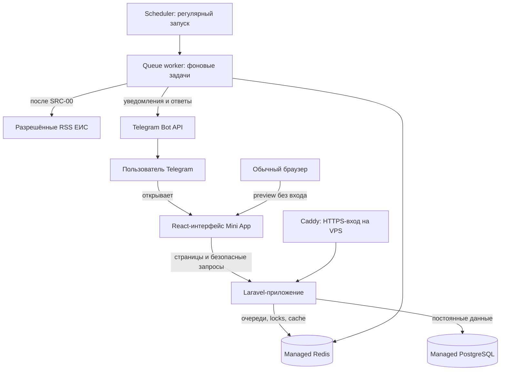
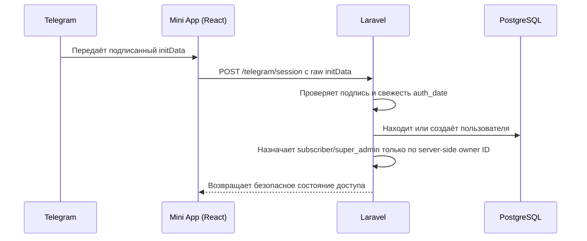
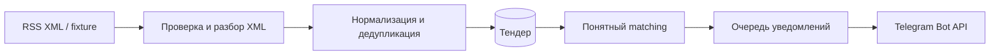
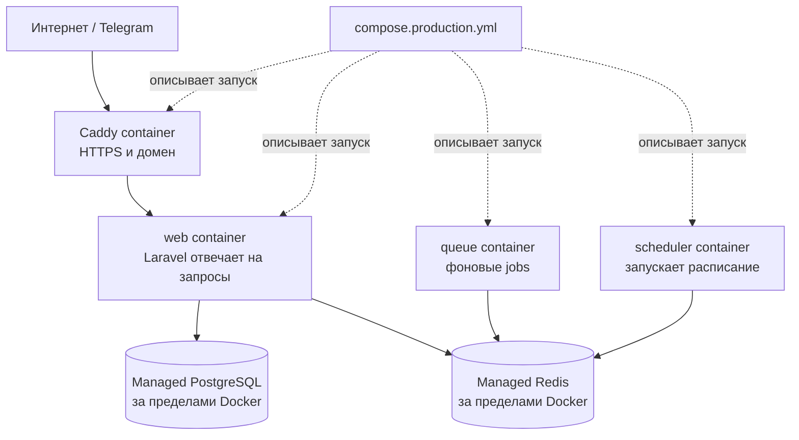

# Tender Finder: путеводитель для разработчика из WordPress

> **Коротко:** Tender Finder — это не готовая CMS, как WordPress, а приложение,
> которое мы собираем из кода. Laravel здесь играет роль серверного «движка»,
> React — роль очень кастомной темы интерфейса, PostgreSQL — постоянной базы
> данных, а Redis — быстрого помощника для очередей и временных задач.

Этот файл написан для человека, который уверенно работал с WordPress, но пока
не обязан знать Laravel, Docker, очереди или Telegram Mini Apps. Он описывает
**состояние проекта на 25 августа 2026 года**: что уже есть в коде, что лишь
подготовлено и что пока нельзя называть работающей production-функцией.

## Сначала — честная картина

Сейчас пользователь уже может открыть красивый demo-интерфейс Tender Finder в
Telegram или браузере. В коде уже подготовлены настоящие серверные механизмы:
будущая база данных, безопасный вход из Telegram, согласия, trial, запросы,
RSS-обработка и антиспам-уведомления.

Но это **не значит, что они уже включены в production**. Для включения нужны
VPS, managed PostgreSQL, managed Redis, публичные ссылки на оферту и политику,
а затем ручная проверка Telegram. Пока production на Vercel остаётся честным
demo/preview. Реальные платежи Stars и live RSS также выключены.

## Словарик: WordPress и это приложение

Laravel не является CMS: в нём нет готовой админки, записей, страниц и плагинов
«из коробки». Но полезная аналогия с WordPress есть.

| Если вы знаете WordPress | Ближайшая аналогия в Tender Finder | Что это означает на практике |
|---|---|---|
| WordPress core | Laravel | PHP-движок принимает запрос, запускает правила и отдаёт ответ. |
| Тема WordPress | React-компоненты в `resources/js` | Внешний вид экранов Mini App: карточки, формы, навигация. |
| Шаблон страницы | React page + Inertia | Экран получает данные от Laravel и рисуется без отдельного React Router. |
| Плагин | Laravel service / job / middleware | Небольшая часть бизнес-логики: trial, проверка Telegram, RSS, уведомления. |
| `functions.php`, hooks | routes, controllers, services | Код решает, на какой URL ответить и какие действия выполнить. |
| Таблицы `wp_*` | migrations + models | Миграции создают структуру БД, модели удобно работают с её строками. |
| WP-Cron | Laravel Scheduler | Регулярно запускает задачи, например будущую проверку RSS. |
| Плагин кеша / фоновые задачи | Redis + queue worker | Быстро передаёт длинные задачи фоновому обработчику. |
| `wp-config.php` | `.env` + `config/*` | Настройки окружения. Секреты живут вне Git. |
| Nginx / Apache на хостинге | Caddy на VPS | Принимает HTTPS-запросы из интернета и передаёт их приложению. |

Если совсем по-простому: в WordPress вы обычно настраиваете готовый дом и
добавляете функции вокруг него. Здесь мы сами создаём доменную модель и
правила, поэтому можем точнее контролировать Telegram-вход, доступ, лимиты,
очереди и безопасность.

## Кто с кем разговаривает



Как читать схему:

1. Пользователь открывает Mini App из Telegram. В обычном браузере тот же UI
   можно посмотреть, но это лишь preview: он не создаёт пользователя и не даёт
   доступ к серверным функциям.
2. React показывает интерфейс и отправляет нужные запросы в Laravel.
3. Laravel решает, можно ли выполнить действие. Он не доверяет данным,
   нарисованным в браузере.
4. PostgreSQL хранит долговечные сущности: пользователя, согласия, доступ,
   поисковые запросы и будущие тендеры.
5. Redis помогает быстро передавать долгие задачи в очередь. Например, не
   заставлять пользователя ждать, пока обработается RSS или отправится
   уведомление.
6. Scheduler регулярно создаёт задачи, queue worker исполняет их в фоне.
7. RSS и отправка в Telegram включатся только после внешней проверки и
   production smoke-test.

## Два режима, которые важно не путать

| Режим | Где находится | Что работает сейчас | Чего там пока нет |
|---|---|---|---|
| **Vercel demo** | текущий публичный Mini App | Экраны, навигация, demo-данные, `/health` | Постоянной БД, Redis-очередей, настоящей Telegram-сессии, trial, RSS, платежей |
| **Будущий VPS runtime** | ещё предстоит развернуть | В нём подготовлен запуск `web`, `queue`, `scheduler`, HTTPS и readiness-check | Его нужно подключить к managed PostgreSQL/Redis и проверить вручную |
| **Локальная разработка** | ваш компьютер | Код, тесты, frontend-сборка | Docker на текущем компьютере пока не установлен; без реальной БД нельзя проверить PostgreSQL-миграции локально |

То есть код серверного сценария есть, но переключатель боевого режима ещё
сознательно не включён. Это защита от ситуации «кнопка выглядит настоящей, а
данные некуда безопасно сохранить».

## Где что лежит в проекте

```text
TenderFinder/
├── app/                    Laravel-код: правила и бизнес-логика
│   ├── Http/               HTTP-вход: controllers, middleware, requests
│   ├── Jobs/               фоновые задания очереди
│   ├── Models/             PHP-модели таблиц БД
│   ├── Services/           сценарии: Telegram, trial, доступ, queries
│   └── Tenders/            RSS, нормализация, matching, уведомления
├── config/                 контракты настроек без секретных значений
├── database/
│   ├── migrations/         «история ремонта» структуры БД
│   └── factories/          генераторы тестовых данных
├── deploy/                 файлы для будущего VPS: Caddy и entrypoint
├── docs/                   понятные и технические документы проекта
├── resources/
│   ├── js/                 React/TypeScript-интерфейс Mini App
│   │   ├── Components/     переиспользуемые элементы интерфейса
│   │   └── Pages/          конкретные экраны
│   └── css/                стили и дизайн-токены
├── routes/                 список URL и консольных расписаний
├── tests/                  автоматические проверки поведения
├── Dockerfile              рецепт контейнера приложения
├── compose.production.yml  схема совместного запуска процессов на VPS
└── .env.example            перечень нужных переменных, без секретов
```

### Что значит каждая серверная папка

- `routes/web.php` — «список страниц сайта». Здесь Laravel узнаёт, что делать
  при переходе на `/plans`, `/queries`, `/health` и так далее.
- `routes/api.php` — входы, не привязанные к обычной HTML-странице: Telegram
  webhook находится здесь.
- `app/Http/Controllers` — диспетчеры. Похожи на обработчик WordPress-хука:
  принимают запрос, проверяют его и вызывают нужную логику.
- `app/Services` — правила бизнеса, которые не должны жить в контроллере.
  Например: «trial можно начать один раз и только после двух согласий».
- `app/Models` — удобные PHP-представления строк БД. `User` соответствует
  пользователю, `SearchQuery` — сохранённому мониторингу и т. п.
- `app/Jobs` — длительные действия «сделай позже». Их выполняет не запрос
  пользователя, а отдельный queue worker.
- `database/migrations` — файлы, из которых Laravel строит таблицы. Это
  похоже на контролируемые SQL-изменения вместо ручного редактирования БД в
  phpMyAdmin. Миграции применяются по порядку и остаются историей схемы.

### Где находится интерфейс

`resources/js/Pages` — полные экраны: onboarding, dashboard, тендеры, профиль,
планы и «Мои мониторинги». `resources/js/Components` — переиспользуемые
строительные блоки, например `AppShell`, кнопки, карточки, формы и skeletons.

Inertia связывает Laravel и React. Представьте это как тему, у которой данные
страницы приходят не из WordPress Loop, а из Laravel-контроллера. Переходы
выглядят как SPA, но сервер остаётся главным источником данных и правил.

## Что уже делает серверный код

### 1. Вход из Telegram



Критически важно: UI не может «сам назначить себя админом». Полезны только
данные, чья подпись проверена на сервере. `initDataUnsafe` — это удобная
подсказка для интерфейса, но не пропуск в систему.

Сейчас браузерный fallback остаётся анонимным preview. Если открыть приложение
не внутри проверяемого Telegram-контекста, сервер не создаст аккаунт, trial или
доступ.

### 2. Согласия и trial

1. Пользователь принимает актуальную оферту и политику.
2. Laravel сохраняет отдельные append-only события согласия. «Append-only» —
   значит старое событие не затирается: при отзыве добавляется новое событие.
3. Пользователь нажимает старт trial.
4. Сервер перепроверяет оба согласия, ставит пометку «trial уже использован» и
   выдаёт Basic-доступ на 72 часа.
5. Будущий VPS scheduler подготовит одно напоминание примерно за 24 и 3 часа,
   а после окончания сам заморозит активные мониторинги и отменит ожидающие
   уведомления. В текущем Vercel demo эта фоновая работа не включена.
6. Для закрытой беты Basic/trial разрешает максимум **три активных
   мониторинга**. Этот лимит проверяется сервером, а не только кнопкой UI.

### 3. Запросы на тендеры

Серверная часть может хранить ключевые и минус-слова, регион, бюджет и дедлайн.
Мониторинг можно поставить на паузу, заморозить или удалить. Анонимный preview
не получает доступ к `/queries`: он возвращается в onboarding.

### 4. RSS, matching и уведомления

Это уже написано и покрыто тестами, однако внешнее чтение RSS выключено.



- Сначала используются synthetic fixtures — безопасные учебные XML-файлы,
  а не непроверенный live-источник.
- Для настоящего ЕИС-контента есть allowlist URL, лимит размера ответа, таймауты
  и классы ошибок. Нельзя подсунуть приложению произвольный сайт.
- Первый успешный опрос ленты ничего не рассылает: он заполняет начальную
  картину, чтобы пользователь не получил лавину старых публикаций.
- Матчинг детерминированный: все обязательные слова должны быть найдены,
  минус-слово исключает тендер, известные бюджет/регион/дедлайн проверяются.
  Причины совпадения сохраняются и могут быть показаны человеку. Здесь нет
  LLM и нет неподтверждённых «процентов успеха».
- Антиспам-правило: максимум 20 карточек в час на пользователя, дальше — один
  digest из десяти лучших. Фактическая доставка в Telegram ждёт VPS и реальный
  bot smoke-test.

## База данных без страшных слов

PostgreSQL — это более строгая и мощная база, чем «просто таблицы». Она будет
хранить то, что должно пережить перезапуск приложения:

| Группа | Примеры таблиц | Зачем она нужна |
|---|---|---|
| Личность и права | `users`, `consent_events` | Понять, кто вошёл через Telegram и какие документы он принял. |
| Доступ | `plans`, `subscriptions`, `entitlements` | Не путать роль человека, выбранный план и временный доступ. |
| Мониторинги | `search_queries` | Хранить, что именно пользователь хочет отслеживать. |
| Источники и тендеры | `source_feeds`, `tenders`, `source_feed_items` | Безопасно разобрать ленту и не создавать дубликаты. |
| Совпадения и доставка | `tender_query_matches`, `notification_deliveries` | Объяснить результат и не послать одно сообщение дважды. |

Полная простая и техническая схема с ERD находится в
[DATABASE.md](DATABASE.md). Она также говорит, какие данные мы **не храним**:
raw Telegram `initData`, бот-токены, cookies, содержимое чужих секретов и
ненужные персональные данные.

## Docker: зачем он здесь

Docker не является ещё одной базой данных и не заменяет VPS. Это способ
упаковать приложение вместе с понятными версиями PHP, расширений и команд в
повторяемый «контейнер».

Удобная бытовая аналогия:

| Термин | Простое объяснение |
|---|---|
| `Dockerfile` | Рецепт: какую PHP/Node-среду взять и как собрать приложение. |
| Image | Готовая заготовка по рецепту — как образ диска или запечатанная кухня. |
| Container | Запущенная копия image: уже работающий процесс. |
| Compose | Лист для оркестратора: какие контейнеры запустить вместе и как их связать. |



Почему это нам полезно:

- VPS не должен вручную угадывать, какие PHP-расширения нужны Laravel. Image
  уже содержит нужную среду.
- Web, queue и scheduler — три разные обязанности. Если отправка уведомления
  долго думает, веб-интерфейс не должен из-за этого «висеть».
- Caddy берёт на себя публичный HTTPS и передаёт запрос дальше в Laravel.
- Один и тот же Compose-набор можно предсказуемо поднять на VPS, проверить и
  при проблеме откатиться на Vercel как временный rollback.

Чего Docker **не делает**:

- не создаёт автоматически безопасную production-БД;
- не сохраняет секреты в Git;
- не включает Telegram webhook или платежи сам по себе;
- не отменяет нужду в backups и мониторинге managed PostgreSQL/Redis.

В этом проекте Docker-файлы уже подготовлены: `Dockerfile`,
`compose.production.yml`, `deploy/Caddyfile` и `deploy/entrypoint.sh`. На
текущем локальном компьютере Docker CLI не установлен, поэтому первый честный
container smoke-test должен пройти на подготовленном VPS (или отдельной
Docker-машине), а не быть «отмечен на глаз».

## Как приложение запускается

### Для обычной локальной разработки

Конкретные команды и требования перечислены в корневом
[README.md](../README.md). Смысл процесса такой:

1. `composer install` загружает PHP-зависимости Laravel.
2. `npm ci` загружает JavaScript-зависимости React/Vite.
3. `.env` настраивается **локально** из `.env.example`; его никогда не кладут
   в Git и не копируют в документацию.
4. `php artisan migrate` строит таблицы в доступной тестовой/локальной БД.
5. `npm run dev` удобен во время рисования UI, а `npm run build` собирает
   production-файлы React.
6. Laravel запускается локальным PHP runtime (например, Laravel Herd) либо в
   подготовленном Docker runtime.

### На будущем VPS

1. Оператор создаёт отдельные production-секреты и подключает managed
   PostgreSQL/Redis.
2. Docker Compose запускает `web`, `queue`, `scheduler` и Caddy.
3. Выполняется миграция БД и закрытый readiness-check.
4. Только после этого тестируются Telegram `initData`, `/start`, `/help`,
   webhook и trial.
5. Лишь успешный smoke-test разрешает перенести Mini App URL и webhook с
   Vercel на VPS.

Пошаговая эксплуатационная инструкция для оператора —
[DEPLOYMENT.md](DEPLOYMENT.md). В ней нет и не должно быть настоящих секретов.

## Проверки: зачем столько команд

Перед отправкой изменений в Git выполняются:

| Команда | Что ловит |
|---|---|
| `npm run build` | Ошибки TypeScript/Vite и production-сборки интерфейса. |
| `php artisan test` | Автоматические сценарии Laravel: вход, trial, RSS и другие правила. |
| `vendor/bin/pint --test` | Единый стиль PHP-кода. |
| `vendor/bin/phpstan analyse --memory-limit=1G` | Ошибки типов и опасные вызовы PHP до запуска. |
| `npm run lint` | Ошибки/неаккуратности TypeScript и React. |
| `npm run format:check` | Проверка единого форматирования frontend-файлов. |

Это похоже на набор обязательных проверок перед выкладкой плагина или темы, но
их исполняет проект автоматически и одинаково у всех разработчиков.

## Что нельзя делать случайно

- Не добавлять в Git `.env`, `dump.rdb`, `tmp-free-zakupki-monitor/`, токены,
  ключи, cookies или персональные данные.
- Не включать `RSS_LIVE_POLLING_ENABLED` до задачи `SRC-00`, где вручную
  подтверждены ленты ЕИС, поля и лимиты.
- Не считать Vercel demo полноценной серверной production-функцией.
- Не включать Telegram Stars, пока не согласованы цены, legal-тексты,
  managed-инфраструктура и тестовый сценарий оплаты/возврата.
- Не назначать `super_admin` из UI. Роль получает только верифицированный
  Telegram ID владельца из server-side секретной конфигурации.

## С чего читать документы дальше

Если есть 20 минут, лучше идти в таком порядке:

1. Этот файл — общая карта и словарь.
2. [docs/README.md](README.md) — что строим и в каком порядке.
3. [DATABASE.md](DATABASE.md) — простая карта данных, затем технический ERD.
4. [DEPLOYMENT.md](DEPLOYMENT.md) — что понадобится для VPS и переключения.
5. [PROGRESS.md](PROGRESS.md) — история решений, текущие задачи и блокеры.
6. [NEXT-CHAT-HANDOFF.md](NEXT-CHAT-HANDOFF.md) — готовый контекст для нового
   чата, когда нужно продолжить разработку.

## Маленький словарь терминов

| Термин | Человеческое значение |
|---|---|
| API endpoint | Адрес, куда интерфейс отправляет запрос за действием или данными. |
| Middleware | Охранник перед endpoint: проверяет, можно ли пройти дальше. |
| Migration | Версионируемое изменение структуры таблиц БД. |
| Queue / job | Очередь задач и отдельное поручение, выполняемое в фоне. |
| Scheduler | Будильник, который регулярно создаёт нужные задания. |
| Redis | Быстрая временная память для очередей, кеша и блокировок. |
| Managed service | БД/Redis, за обслуживание, backups и доступность которых отвечает провайдер. |
| `initData` | Подписанный Telegram набор данных, которым сервер может подтвердить вход. |
| Entitlement | Конкретное право доступа: например, Basic на 72 часа и лимит 3 запросов. |
| Idempotency | Повтор того же запроса не создаёт второй trial, второй webhook-эффект или дубль уведомления. |
| Smoke-test | Короткая реальная проверка главного пути после развёртывания. |

---

Если формулировка в документации всё ещё звучит слишком «бэкендно», это не
проблема: такой текст нужно улучшать. Цель документа — помочь принимать
продуктовые решения осознанно, а не заставить вас выучить все термины сразу.
