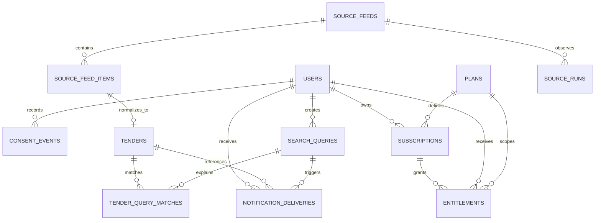

# Tender Finder: база данных и путь данных

Этот документ отвечает на два разных вопроса. Первая часть объясняет простыми
словами, что и зачем хранит сервис. Вторая нужна разработке и эксплуатации:
она описывает таблицы, связи, индексы, состояния и безопасный порядок миграций.

Статус на 2026-08-27: схема, migrations и автоматические тесты готовы.
Локальный Docker MVP уже хранит результаты ручного поиска ЕИС и личные
операторские отметки. Production-база и публичный пользовательский режим ещё
не запущены: для них нужны managed PostgreSQL, Redis и отдельный cutover.

## Простая карта: что происходит с данными

1. Человек открывает Mini App внутри Telegram. Сервер проверяет специальную
   подпись Telegram, а не верит имени или ID из браузера.
2. После проверки появляется одна запись пользователя. В ней хранятся минимум
   нужных полей профиля и время последнего визита.
3. Перед trial человек принимает оферту и политику. Мы не «перезаписываем
   галочку», а записываем событие: какой документ, какой версии и когда был
   принят или отозван.
4. Trial создаёт отдельные записи тарифа, подписки и права доступа. Поэтому
   роль человека не меняется при покупке или окончании trial.
5. Настроенный запрос хранится отдельно: название, ключевые слова, исключения,
   регион, бюджет, срок, условия источника и состояние паузы. В local MVP его
   можно вручную запустить повторно без включения фонового мониторинга.
6. RSS-лента сначала попадает в безопасную «приёмную»: её URL проверяется,
   элементы дедуплицируются. Затем получаются нормальные карточки тендеров,
   понятные причины совпадения и журнал доставки уведомлений.
7. Результат ручного поиска сохраняется как персональный снимок: у одного
   пользователя он не открывает карточки и отметки другого.

Для аналитики это значит: `subscriber` — право доступа к продукту, а не
тип оплаты. Воронка строится по состоянию доступа и источнику подписки:
`preview`, `trial`, оплата через Stars, ручная выдача и истёкший доступ.

### Что база принципиально не хранит

- Telegram bot token, webhook secret, owner ID, ключ Laravel и пароль БД;
- raw `initData`, cookies, полные HTTP-заголовки и полный raw webhook payload;
- платёжные данные до отдельного Stars-этапа;
- содержимое личных сообщений Telegram;
- скриншоты, документы ТЗ и LLM-prompts до отдельного privacy/cost gate.

IP не сохраняется как текст: для события согласия допустим только HMAC-хеш.
Чат для `/start` и `/help` живёт только в очереди до ответа бота, не в таблице
webhook-обновлений.

## Наглядная схема

## Техническая модель

### Identity и legal basis

| Таблица | Главное содержимое | Почему нужна | Ключи и ограничения |
|---|---|---|---|
| `users` | verified `telegram_id`, безопасные display fields, роль, `last_seen_at`, `trial_used_at` | единый человек в продукте | уникальный `telegram_id`; роль только `subscriber` или `super_admin` на уровне кода |
| `consent_events` | документ, версия, `accepted`/`revoked`, время, IP HMAC | доказуемая история legal choice без перезаписи | индекс `(user_id, document, occurred_at)`; append-only на уровне сервиса |
| `telegram_updates` | update ID, тип, status, время обработки, безопасный failure code | дедупликация webhook | уникальный `telegram_update_id`; raw payload отсутствует |

У `users` сохранены nullable `email` и `password` как временные legacy-поля
Laravel. Они не участвуют в Telegram-авторизации. Старая роль `admin` при
migration переводится в `subscriber`, поэтому у неё нет «случайного» доступа.
Только подтверждённый `telegram_id`, входящий в server-side список
`TELEGRAM_SUPERADMIN_IDS` (либо legacy `TELEGRAM_OWNER_ID`), получает
`super_admin`. Значение сверяется на каждом Telegram Mini App входе: удаление
ID из списка понижает роль при следующей авторизации.

### Доступ и планы

| Таблица | Главное содержимое | Правило |
|---|---|---|
| `plans` | code, имя, флаг активности, JSON limits | это каталог возможностей, не роль |
| `subscriptions` | пользователь, plan, `trial`/будущий Stars/admin source, status, интервал | описывает период продукта |
| `entitlements` | конкретное право, значение, интервал, metadata | server-side проверка лимитов без доверия React |

Первый trial создаёт Basic plan и entitlement `active_queries = 3` на 72 часа.
Повторный trial блокируется marker `users.trial_used_at` под DB-lock. JSON в
этих таблицах хранит только небольшой набор limits/metadata; ключевые связи
остаются нормальными foreign keys.

Когда срок trial проходит, lifecycle‑задача помечает его subscription и
entitlement как `expired`, меняет активные `search_queries` на `frozen` и
помечает ожидающие `notification_deliveries` как `skipped`. Ничего не
удаляется физически: это сохраняет объяснимую историю и не даёт повторной
очереди отправить старое уведомление. Эта задача выполняется только постоянным
Railway scheduler service, а не HTTP-процессом web-приложения.

### Tender core

| Таблица | Главное содержимое | Правило |
|---|---|---|
| `search_queries` | название, keywords/minus words, region, money/deadline range, условия источника и status | active/paused/frozen/deleted; максимум 3 active при Basic/trial; ручной запуск сам не включает polling |
| `source_feeds` | канонический RSS URL и SHA-256 hash, расписание, freshness/error | ручные страницы ЕИС имеют `manual_preview`; active polling не включён |
| `source_feed_items` | отдельная RSS-запись, URL hash, `reg_number`, content hash | уникальны на ленту по URL hash |
| `tenders` | каноническая карточка, source + external ID, поля для фильтра | уникальны по `(source, external_id)` |
| `tender_user_states` | личная отметка local MVP для карточки | уникальна по `(user_id, tender_id)`; `favorite`, `potential`, `dismissed` или `archived` |
| `local_mvp_search_snapshots` | nullable ссылка на сохранённый запрос, фраза, режим релевантности, минус-слова, причины совпадения, счётчики и IDs карточек одной ручной выдачи ЕИС | пользователь владеет снимком; ссылка позволяет показать последние 20 запусков запроса; «только новые» вычисляется относительно непосредственно предыдущего снимка того же запроса; разовые поиски остаются без ссылки; история переживает refresh/restart и не смешивается между пользователями |
| `tender_query_matches` | связь тендер ↔ запрос и JSON причин | уникальна по `(tender_id, search_query_id)` |
| `notification_deliveries` | тип, idempotency key, status и безопасный payload | повторный job не пошлёт одну карточку дважды |
| `source_runs` | start/end, status, счётчики, error class | материал для будущего Live Ops |

В JSONB PostgreSQL будут естественно храниться `keywords`/safe filters,
`match_reasons` и небольшие metadata. Это не «свалка»: поиск, ownership,
статусы, даты, денежные значения и связи остаются отдельными колонками для
индексов и проверок. В SQLite-тестах те же поля представлены JSON, поэтому
migrations проверяются локально; production contract — PostgreSQL 16.

### Состояния

| Область | Значения сейчас | Кто меняет |
|---|---|---|
| role | `subscriber`, `super_admin` | только verified Telegram identity service |
| access | `preview`, `trialing`, `active`, `expired`, `cancelled` | AccessService на основе entitlement и времени |
| subscription/entitlement | `active`, `expired`, `cancelled` | Trial/будущий billing domain |
| query | `active`, `paused`, `frozen`, `deleted` | authenticated query service |
| local MVP tender state | `new`, `favorite`, `potential`, `dismissed`, `archived` | только local technical `super_admin` для карточек ЕИС |
| admin access analytics | `registered`, `preview`, `trialing`, `paid`, `granted`, `expired` | read-only aggregate только для `super_admin`; без Telegram ID и иных персональных данных |
| notification | `queued`, `sent`, `failed`, `skipped` | queue transport |
| source run | `running`, `succeeded`, `failed` | RSS importer |

## Индексы и почему они есть

- `users.telegram_id` и `telegram_updates.telegram_update_id` — быстрый поиск
  identity и защита от повторного webhook;
- `(user_id, status)` для запросов и `(user_id, code, status, ends_at)` для
  entitlement — проверка лимита в серверном запросе;
- SHA-256 URL hashes и `(source, external_id)` — дедупликация лент и тендеров;
- unique `(tender_id, search_query_id)` и `notification_deliveries.idempotency_key`
  — повтор очереди не создаёт второй match/сообщение;
- timestamps source run/feed — будущие freshness и Live Ops без client-side
  догадок.

## Порядок production migration

1. Сделать managed PostgreSQL backup/snapshot и проверить restore-процедуру.
2. Заполнить Railway Variables: DB/Redis reference variables, Telegram,
   legal URLs/versions и readiness token.
3. Запустить web service с Railway Pre-Deploy Command
   `sh railway/migrate.sh`; worker и scheduler не должны запускать миграции.
4. Проверить authenticated `GET /ops/readiness` и public `GET /health`.
5. Выполнить smoke-test подписанной Telegram session, consent и trial на
   отдельном тестовом пользователе. Не включать webhook или live RSS раньше.
6. После проверки установить Railway HTTPS URL как Mini App URL и Telegram
   webhook. Откат выполняется на предыдущий Railway deployment после backup и
   проверки совместимости migration.

Миграции намеренно не включают будущие `payments`, `billing_events`,
`campaigns`, `campaign_deliveries`, `admin_audit_logs` и aggregated
`system_metrics`: их добавят вместе с реальной бизнес-функцией и тестами, а не
заранее пустыми таблицами.

## Локальная база для разработки

`compose.local.yml` поднимает отдельный PostgreSQL 16 в именованном Docker
volume `tender_finder_local_postgres`. Он не публикует порт базы наружу и не
используется Railway production. Для него создаётся только
некоммитируемый `deploy/local-runtime.env`; его значения локальны и не должны
совпадать с VPS.

Синтетические RSS fixtures создают безопасные тестовые записи. Отдельно
ручной local MVP может сохранить данные ЕИС, полученные после нажатия
оператора. Ни один из путей не включает production-пользователей, Telegram
уведомления или постоянный polling.
