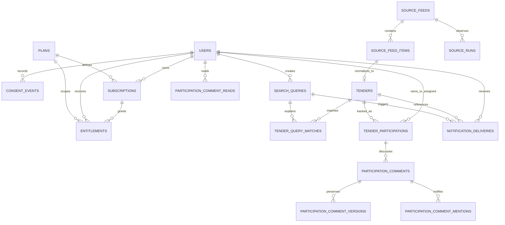

# Tender Finder: база данных и путь данных

Этот документ отвечает на два разных вопроса. Первая часть объясняет простыми
словами, что и зачем хранит сервис. Вторая нужна разработке и эксплуатации:
она описывает таблицы, связи, индексы, состояния и безопасный порядок миграций.

Статус на 2026-09-29: production использует PostgreSQL 16 и Redis в Docker
Compose на VPS. Все forward-only миграции коммита `06c331b`, включая
`2026_09_29_120000_add_support_tickets`, применены; `migrate:status` не
показывает ожидающих миграций. Локальные тесты используют SQLite `:memory:`.
Ни этот документ, ни миграции не содержат секретов production-окружения.

## Простая карта: что происходит с данными

1. Человек открывает Mini App внутри Telegram. Сервер проверяет специальную
   подпись Telegram, а не верит имени или ID из браузера.
2. После проверки появляется одна запись пользователя. В ней хранятся минимум
   нужных полей профиля и время последнего визита.
3. Перед trial человек принимает оферту и политику. Мы не «перезаписываем
   галочку», а записываем событие: какой документ, какой версии и когда был
   принят или отозван.
4. Trial создаёт отдельные записи тарифа, подписки и права доступа. Поэтому
   роль человека не меняется при покупке или окончании trial.
5. Мониторинг хранится отдельно: название, ключевые слова, исключения, регион,
   бюджет, срок, выбранный шаблон RosTender и состояние паузы. Его можно
   проверить вручную; активный мониторинг также опрашивается по расписанию.
6. Разрешённый источник передаёт карточки через общую нормализацию и
   дедупликацию. Затем сохраняются причины совпадения и журнал доставки
   уведомлений. Прежние RSS-строки ЕИС остаются архивом без нового опроса.
7. Совпадения сохраняются в персональной ленте: один пользователь не видит
   чужие карточки, отметки и историю мониторинга.

Для аналитики это значит: `subscriber` — право доступа к продукту, а не
тип оплаты. Воронка строится по состоянию доступа и источнику подписки:
`preview`, `trial`, оплата через Stars, ручная выдача и истёкший доступ.

### Что база принципиально не хранит

- Telegram bot token, webhook secret, owner ID, ключ Laravel и пароль БД;
- raw `initData`, cookies, полные HTTP-заголовки и полный raw webhook payload;
- платёжные данные до отдельного Stars-этапа;
- содержимое личных сообщений Telegram;
- скриншоты, документы ТЗ и LLM-prompts до отдельного privacy/cost gate.

IP не сохраняется как текст: для события согласия допустим только HMAC-хеш.
Чат для `/start` и `/help` живёт только в очереди до ответа бота, не в таблице
webhook-обновлений.

## Наглядная схема

```mermaid
erDiagram
    USERS ||--o{ CONSENT_EVENTS : records
    USERS ||--o{ SUBSCRIPTIONS : owns
    PLANS ||--o{ SUBSCRIPTIONS : defines
    SUBSCRIPTIONS ||--o{ ENTITLEMENTS : grants
    USERS ||--o{ ENTITLEMENTS : receives
    PLANS ||--o{ ENTITLEMENTS : scopes
    USERS ||--o{ SEARCH_QUERIES : creates
    SOURCE_FEEDS ||--o{ SOURCE_FEED_ITEMS : contains
    SOURCE_FEED_ITEMS ||--o| TENDERS : normalizes_to
    TENDERS ||--o{ TENDER_QUERY_MATCHES : matches
    SEARCH_QUERIES ||--o{ TENDER_QUERY_MATCHES : explains
    USERS ||--o{ TENDER_PARTICIPATIONS : owns_or_assigned
    TENDERS ||--o{ TENDER_PARTICIPATIONS : tracked_as
    TENDER_PARTICIPATIONS ||--o{ PARTICIPATION_COMMENTS : discusses
    PARTICIPATION_COMMENTS ||--o{ PARTICIPATION_COMMENT_VERSIONS : preserves
    PARTICIPATION_COMMENTS ||--o{ PARTICIPATION_COMMENT_MENTIONS : notifies
    USERS ||--o{ PARTICIPATION_COMMENT_READS : reads
    USERS ||--o{ NOTIFICATION_DELIVERIES : receives
    TENDERS ||--o{ NOTIFICATION_DELIVERIES : references
    SEARCH_QUERIES ||--o{ NOTIFICATION_DELIVERIES : triggers
    SOURCE_FEEDS ||--o{ SOURCE_RUNS : observes
```

## Техническая модель

### Identity и legal basis

| Таблица | Главное содержимое | Почему нужна | Ключи и ограничения |
|---|---|---|---|
| `users` | verified `telegram_id`, безопасные display fields, роль, `last_seen_at`, `trial_used_at` | единый человек в продукте | уникальный `telegram_id`; роль только `subscriber` или `super_admin` на уровне кода |
| `consent_events` | документ, версия, `accepted`/`revoked`, время, IP HMAC | доказуемая история legal choice без перезаписи | индекс `(user_id, document, occurred_at)`; append-only на уровне сервиса |
| `telegram_updates` | update ID, тип, status, время обработки, безопасный failure code | дедупликация webhook | уникальный `telegram_update_id`; raw payload отсутствует |

У `users` сохранены nullable `email` и `password` как временные legacy-поля
Laravel. Они не участвуют в Telegram-авторизации. Старая роль `admin` при
migration переводится в `subscriber`, поэтому у неё нет «случайного» доступа.
Только подтверждённый `telegram_id`, входящий в server-side список
`TELEGRAM_SUPERADMIN_IDS` (либо legacy `TELEGRAM_OWNER_ID`), получает
`super_admin`. Значение сверяется на каждом Telegram Mini App входе: удаление
ID из списка понижает роль при следующей авторизации.

Для локальной приёмки есть отдельное исключение, не являющееся моделью данных:
при `LOCAL_MVP_FULL_ACCESS_ENABLED=true` и только в окружениях `local`/`testing`
local-запись и подтверждённый Telegram-вход временно получают `super_admin`.
`AccessService` возвращает активный snapshot без создания `subscriptions` или
`entitlements`; поэтому локальная приёмка не производит фиктивные платежные
или подписочные записи. На VPS этот флаг должен быть выключен.

### Доступ и планы

| Таблица | Главное содержимое | Правило |
|---|---|---|
| `plans` | code, имя, флаг активности, JSON limits | это каталог возможностей, не роль |
| `subscriptions` | пользователь, plan, `trial`/будущий Stars/admin source, status, интервал | описывает период продукта |
| `entitlements` | конкретное право, значение, интервал, metadata | server-side проверка лимитов без доверия React |

Первый trial создаёт Basic plan и entitlement `active_queries = 3` на 72 часа.
Повторный trial блокируется marker `users.trial_used_at` под DB-lock. JSON в
этих таблицах хранит только небольшой набор limits/metadata; ключевые связи
остаются нормальными foreign keys.

Когда срок trial проходит, lifecycle‑задача помечает его subscription и
entitlement как `expired`, меняет активные `search_queries` на `frozen` и
помечает ожидающие `notification_deliveries` как `skipped`. Ничего не
удаляется физически: это сохраняет объяснимую историю и не даёт повторной
очереди отправить старое уведомление. Эта задача выполняется только постоянным
production `scheduler`, а не HTTP-процессом web-приложения.

### Tender core

| Таблица | Главное содержимое | Правило |
|---|---|---|
| `search_queries` | название, keywords/minus words, region, money/deadline range, условия источника и status | active/paused/frozen/deleted; максимум 3 active при Basic/trial; ручной запуск сам не включает polling |
| `source_feeds` | источник, внешний идентификатор, расписание, freshness/error | активен для RosTender; строки `eis_rss` сохранены как остановленный архив |
| `source_feed_search_queries` | историческая связь мониторинга с прежней RSS-лентой | новые связи ЕИС не создаются; данные сохранены для объяснимой истории |
| `source_feed_items` | историческая запись источника, URL hash, `reg_number`, content hash | архивные строки не обновляются |
| `tenders` | каноническая карточка, source + external ID и поля для фильтра | уникальны по `(source, external_id)`; `eis_rss` доступен только как архив |
| `tender_user_states` | личный статус, заметка, JSON-теги и дата следующего действия | уникальна по `(user_id, tender_id)`; строка с аннотацией сохраняется и при статусе `new` |
| `local_mvp_search_snapshots` | архивные снимки прежних ручных выдач и технического preview | новые снимки ЕИС не создаются; история не смешивается между пользователями |
| `tender_query_matches` | связь тендер ↔ запрос, JSON причин и объяснимый локальный score | уникальна по `(tender_id, search_query_id)`; score не является решением ИИ и не влияет на match |
| `notification_deliveries` | тип, idempotency key, status и безопасный payload | повторный job не пошлёт одну карточку дважды |
| `source_runs` | start/end, status, счётчики, error class | материал для будущего Live Ops |

В JSONB PostgreSQL будут естественно храниться `keywords`/safe filters,
`match_reasons` и небольшие metadata. Это не «свалка»: поиск, ownership,
статусы, даты, денежные значения и связи остаются отдельными колонками для
индексов и проверок. Локальный Compose-сервис тестов использует SQLite
`:memory:`, а GitHub Actions проверяет migrations на выделенной PostgreSQL
`tender_finder_testing`. Production contract — PostgreSQL 16; тестовый
fail-safe не допускает запуск suite на постоянной dev-базе.

### Участие, обсуждения и экономика

| Таблица | Главное содержимое | Правило |
|---|---|---|
| `tender_participations` | личный или командный контекст, этап, ответственный, причина проигрыша, плановые/фактические суммы, решение go/no-go и независимые версии workflow/экономики | одна заявка на тендер в пределах личной области или команды; денежные поля хранятся как `decimal(18,2)` |
| `participation_comments` | автор, текущий текст, версия, время правки и логического удаления | комментарий остаётся связан с заявкой; автора можно обнулить при удалении пользователя |
| `team_search_queries` | явно подключённые к команде личные мониторинги и автор подключения | одна связь на пару команда/мониторинг; удаление команды или мониторинга удаляет связь |
| `team_tender_reviews` | командный статус первичного разбора, ответственный, причина отклонения и версия | одна карточка разбора на пару команда/тендер; назначения обнуляются при удалении пользователя |
| `team_tender_review_comments` | обсуждение тендера до начала участия | комментарии удаляются вместе с карточкой разбора; автора можно обнулить |
| `participation_comment_versions` | снимок текста, действие, редактор и номер версии | append-only история; версия уникальна внутри комментария |
| `participation_comment_mentions` | адресат упоминания и время прочтения | одно упоминание пользователя в комментарии; создаёт идемпотентную Telegram-доставку |
| `participation_comment_reads` | последний показанный пользователю comment ID для заявки | уникальная позиция чтения на пару заявка/пользователь; новые параллельные комментарии не помечаются прочитанными |
| `participation_documents` | карточка документа, тип, состояние, ответственный, связанная задача, архив и версия | принадлежит одной личной или командной заявке; до 100 документов на заявку |
| `participation_document_versions` | неизменяемая версия приватного файла либо HTTPS-ссылки | старые версии не перезаписываются; скачивание файла проходит авторизацию заявки |
| `calendar_subscriptions` | владелец, необязательная команда, зашифрованный токен, SHA-256 hash, отзыв и последнее использование | одна активная ссылка на область; членство команды проверяется при каждом запросе |

### Поддержка

| Таблица | Главное содержимое | Правило |
|---|---|---|
| `support_tickets` | пользователь, тема, статус, ответственный | пользователь читает только свои записи; администратор — очередь |
| `support_ticket_messages` | сообщения пользователя и поддержки | принадлежность обращению проверяется перед чтением и ответом |
| `support_ticket_events` | создание, ответы и изменения статуса/ответственного с причиной | служебный журнал доступен только `super_admin`; ручное изменение доступа не реализовано |

Права на эти строки выводятся из владельца личной заявки либо активного
членства и роли в команде. Архив команды оставляет данные доступными для чтения
и блокирует изменения и новые доставки. Агрегаты аналитики вычисляются из
заявок и переходов этапов, поэтому отдельная таблица метрик не создаётся.

### Состояния

| Область | Значения сейчас | Кто меняет |
|---|---|---|
| role | `subscriber`, `super_admin` | только verified Telegram identity service |
| access | `preview`, `trialing`, `active`, `expired`, `cancelled` | AccessService на основе entitlement и времени |
| subscription/entitlement | `active`, `expired`, `cancelled` | Trial/будущий billing domain |
| query | `active`, `paused`, `frozen`, `deleted` | authenticated query service |
| local MVP tender state | `new`, `favorite`, `potential`, `dismissed`, `archived` | исторические технические карточки доступны без обновления источника |
| marketing admin analytics | подтверждённая аудитория, регистрации/входы/trial/Stars за 7/30/90 дней, `preview`, `trialing`, `paid`, `granted`, `expired` | read-only aggregate только для `super_admin`; строится из существующих дат и актуального entitlement, без Telegram ID, иных персональных данных или новых таблиц событий |
| notification | `queued`, `sent`, `failed`, `skipped` | queue transport |
| source run | `running`, `succeeded`, `failed` | активный импорт RosTender; прежние RSS-запуски только читаются |

## Индексы и почему они есть

- `users.telegram_id` и `telegram_updates.telegram_update_id` — быстрый поиск
  identity и защита от повторного webhook;
- `(user_id, status)` для запросов и `(user_id, code, status, ends_at)` для
  entitlement — проверка лимита в серверном запросе;
- SHA-256 URL hashes и `(source, external_id)` — дедупликация лент и тендеров;
- unique `(tender_id, search_query_id)` и `notification_deliveries.idempotency_key`
  — повтор очереди не создаёт второй match/сообщение;
- timestamps source run/feed и связь `source_feed_search_queries` —
  пользовательский статус свежести без client-side догадок и без раскрытия
  пользователей общей ленты.

Командный workflow дополнен таблицами `team_workflow_settings` и
`team_tender_routing_rules`. SLA материализуется в `team_tender_reviews`, а
командный scope сохранённых фильтров — в `tender_feed_views.team_id`.
`participation_approval_requests` хранит версию экономики и требуемое число
решений, `participation_approval_votes` — уникальный голос каждого редактора.

## Порядок production migration

1. Проверить свежую резервную копию PostgreSQL и возможность восстановления.
2. Загрузить проверенный архив исходного кода на VPS; на production нет `.git`,
   поэтому `git pull` не используется.
3. Не заменяя и не печатая `.env`, выполнить `sh deploy/vps-deploy.sh` из
   корня приложения. Миграции остаются только forward-only.
4. Проверить `/health`, `web`, `queue`, `scheduler`, PostgreSQL, Redis и
   `php artisan migrate:status`; прямых соединений с ЕИС runtime не выполняет.
5. Сделать закрытый Telegram smoke-test только после выпуска. Откат требует
   совместимости с уже применёнными миграциями, а не удаления schema.

Миграции намеренно не включают будущие `payments`, `billing_events`,
`campaigns`, `campaign_deliveries`, `admin_audit_logs` и aggregated
`system_metrics`: их добавят вместе с реальной бизнес-функцией и тестами, а не
заранее пустыми таблицами.

## Локальная база для разработки

`compose.local.yml` поднимает отдельный PostgreSQL 16 в именованном Docker
volume `tender_finder_local_postgres`. Он не публикует порт базы наружу и не
используется на production VPS. Для него создаётся только
некоммитируемый `deploy/local-runtime.env`; его значения локальны и не должны
совпадать с VPS.

Исторические строки ЕИС могут оставаться в локальной базе для regression-
проверок архива, но приложение больше не создаёт их и не выполняет RSS-polling.
