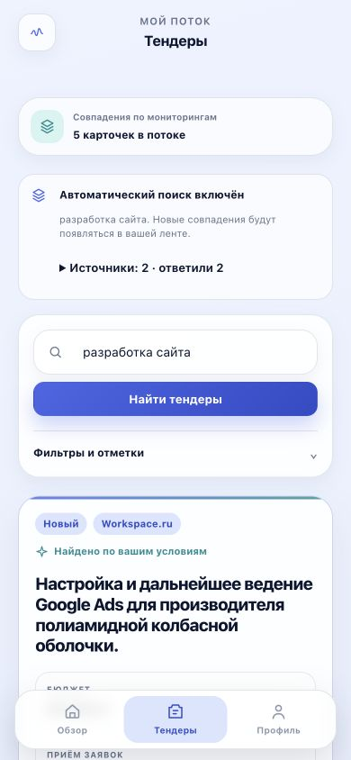
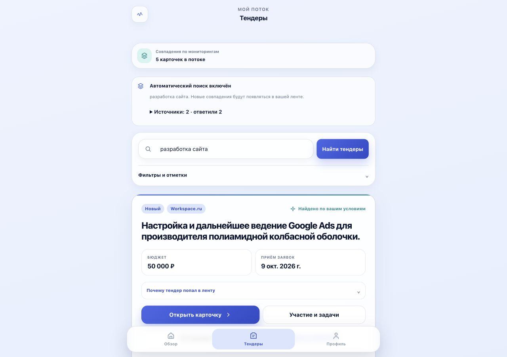

# Общий поиск по источникам: приёмка 1 октября 2026

## Статус

Коммит `d930ec0` прошёл CI в обоих репозиториях и выпущен на production VPS
1 октября 2026 года через `sh deploy/vps-deploy.sh`. Проверены резервная копия
БД, SHA-256 архива, HTTPS health, все шесть сервисов, PostgreSQL, Redis и
`migrate:status`; миграций не было. Точечно включены Workspace.ru и
B2B-Center. Один действующий мониторинг получил публичные ленты без раскрытия
его условий. Production `.env.production` сохранён с режимом `600`.

Росэлторг и РТС-Тендер не интегрированы; Сбер АСТ не включён, потому что
публичный настроенный endpoint не ответил с VPS. Подробности —
[EXTERNAL-SOURCE-DISCOVERY](EXTERNAL-SOURCE-DISCOVERY.md).

## Пользовательский сценарий

1. Пользователь вводит тему и нажимает «Найти тендеры».
2. Сервер создаёт/переиспользует личный мониторинг, добавляет известные открытые
   совпадения и ставит независимые проверки включённых источников в очередь.
3. B2B-Center получает слова через публичную форму. Workspace.ru обновляет RSS.
   RosTender использует свой шаблон и квоту, его отказ не блокирует остальные.
4. Лента подтягивает результат каждые 3 секунды в течение первой минуты, пока
   вкладка видима. Затем продолжает работать серверный мониторинг.
5. Пауза и возобновление доступны в настройках. История успешных ответов
   сохраняется при паузе. Карточки и отметки принадлежат пользователю.

## Реальные данные

- VPS: Workspace HTTP 200, 50 записей, 16 с открытым сроком на момент проверки.
- VPS: B2B общий каталог HTTP 200, 20 карточек.
- B2B по «разработка сайта»: HTTP 200, 1 карточка №4616411 со сроком 9 октября.
- Повторный живой HTTP-запрос из локального контейнера приложения: Workspace 50,
  B2B 1. Импорт и личное сопоставление дали 5 совпадений по словам «разработка
  сайта» (4 Workspace и 1 B2B), повторный проход — 0 новых дубликатов.
- Отдельный заведомо отсутствующий тестовый запрос получил настоящий пустой
  ответ B2B. Интерфейс самостоятельно сменил ожидание на «Пока нет совпадений».
- Реальные Telegram-сообщения в локальной приёмке не отправлялись.

Охват ограничен текущим RSS и одной страницей публичного B2B-поиска. Поиск
слов идёт по названию и описанию: это объяснимое совпадение, не гарантия
смысловой релевантности. Синонимы, полная морфология и полный архив площадок
не реализованы. Для B2B удалённая фраза ограничивает набор до применения
локальных режимов all/any/exact; пагинация и расширение сложных запросов остаются
следующей задачей. Просроченные публичные тендеры не добавляются в новые совпадения.

## Автоматические проверки

- `php artisan test --compact`: **205 passed, 2264 assertions**.
- PHPStan с лимитом 1G: без ошибок.
- Pint: 312 файлов, без замечаний.
- ESLint, Prettier, TypeScript и Vite production build: успешно.
- `git diff --check`: без замечаний перед коммитом.

Добавлены проверки public-only поиска, отдельной личной ленты и прав доступа,
общей очереди без дублей, независимости от квоты RosTender, первичной выдачи
без рассылки, просроченных карточек, общих B2B-лент, pause/resume с историей,
подмены URL, настоящего пустого ответа, изменённой вёрстки, русского окончания
и строгой точной фразы. Отдельно проверено повторное совпадение карточки,
которую обновила другая общая лента. Миграций нет.

## Отдельная ручная UX/UI-проверка

Использован браузер приложения на 390×844 и 1280×900, действующий локальный
пользователь и реальные ответы источников. Подтверждены:

- поиск после входа без CSRF 419; повторное нажатие без дубликатов;
- ожидание до ответа, успешная выдача и подтверждённая пустая выдача;
- автоматическое обновление результата без ручной перезагрузки;
- раскрытие статуса каждого источника, дат последнего ответа и следующей проверки;
- переход из ленты в настоящую клиентскую карточку с описанием и ссылкой;
- ручная проверка в пределах интервала без ложного сообщения о новой очереди;
- пауза/возобновление и сохранение истории источника;
- отсутствие горизонтальной прокрутки на 390 px, перенос длинных заголовков,
  доступность кнопок, отступы и нижняя навигация.

Исправлены устаревший CSRF header, чрезмерная высота панели источников и
неверные тексты о незавершённом первом поиске/запланированном повторе.
Подробности источников скрыты в раскрытии; зона summary и ссылки не ниже 44 px,
есть hover/focus состояния, применяются существующие токены дизайна.

Реальная Telegram Mini App, тёмная тема на устройстве и доставка новых
уведомлений остаются отдельной production beta-приёмкой.

## Production-приёмка и оставшиеся границы

CI: [основной репозиторий](https://github.com/slsforme/saas-bot/actions/runs/36886054791)
и [резервный репозиторий](https://github.com/Oleqq/tender-finder/actions/runs/36886077369)
завершились успешно. Перед релизом создан и `gzip -t` проверен backup
`tender-finder-2026-10-01T15-40-55Z.sql.gz` (режим 600); checksum
исходного архива совпал на Mac и VPS. Стандартный скрипт собрал образы,
выполнил мигратор (`Nothing to migrate`) и перезапустил сервисы.

Production source runs после релиза: B2B-Center — 2 успешных,
Workspace.ru — 1 успешный. В базе 21 карточка B2B-Center и 50 Workspace.ru;
у действующего пользовательского мониторинга появились 1 и 2 личных
совпадения соответственно. Повторная доставка старых карточек в Telegram
не инициировалась. Внешний `/health` вернул HTTP 200 и `ok`; веб, очередь,
планировщик, Caddy, PostgreSQL и Redis работают, PG принимает соединения,
Redis вернул `PONG`, все миграции помечены `Ran`.

Следующий тест владельца — открыть Mini App в настоящем Telegram, выполнить
новый поиск и проверить, что личная лента и карточка отображаются корректно.
Новые мгновенные Telegram-уведомления должны проверяться только на следующей
вновь опубликованной подходящей закупке; текущие 3 совпадения — первичная
историческая загрузка без рассылки.

Для Сбер АСТ нужен рабочий открытый endpoint, доступный из VPS. Текущий
`https://utp.sberbank-ast.ru/VIP/List/PurchaseList` дважды завершился
connection timeout; главная `www.sberbank-ast.ru` с Mac также не ответила.
Публичная международная секция площадки обнаружена, но её видимые карточки
устарели и не заменяют актуальный реестр. Росэлторг/РТС остаются отдельными
техническими задачами.
